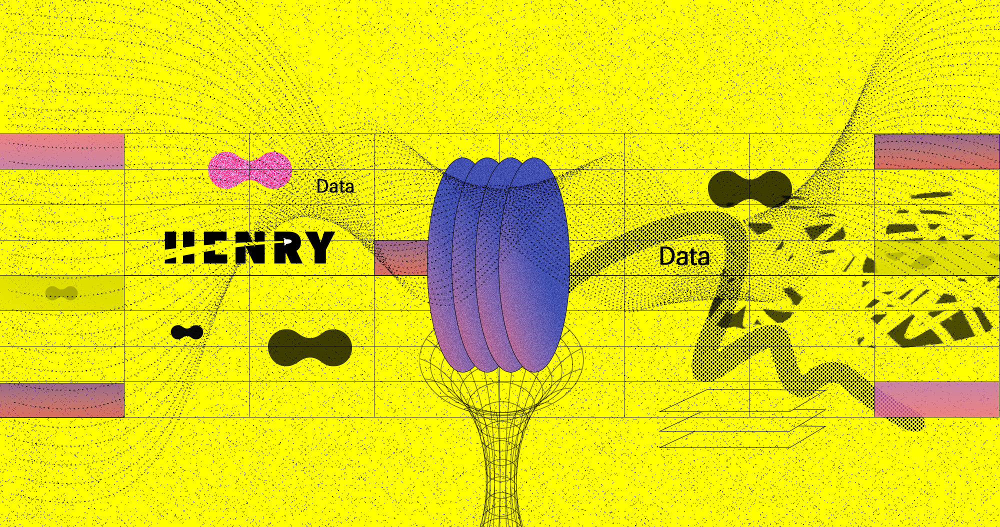

# 📡 Proyecto Individual Nº2: Data Analyst - Federico Piparo📡

----

¡Bienvenidos al último proyecto individual de la etapa de labs! En esta ocasión, asumiré el rol de un Data Analyst para explorar y analizar datos del sector de telecomunicaciones.

## 🌐 Descripción del Problema

### Rol a Desarrollar
Una empresa lider en el sector de telecomunicaciones, *Henry Telecom* necesita un análisis completo del sector a nivel nacional, con un enfoque en la calidad del servicio de internet y otros servicios de comunicación. Este análisis ayudará a identificar oportunidades de crecimiento y plantear soluciones personalizadas para los clientes.

## 📋 Propuesta de Trabajo

### EDA (Exploratory Data Analysis)
Este es el primer punto a desarrollar, y con este surgen dudas como "¿como debo plantear el análisis?" ¿debo analizar todas las tablas o solo las que yo considere importantes? decidi dividir el análisis en dos partes:

`Análisis Básicos y Generales:` Incluyen la identificación de valores nulos, duplicados y outliers en todas las tablas obtenidas de "internet". Estos aspectos son los que se especifican en la rúbrica del proyecto.

`Análisis Específicos:` Varían según cada tabla y se enfocan en detalles particulares de los datos. En este caso este mismo se divide en: Velocidad -TEcnologías - ingresos

### Dashboard
El dashboard debe ser funcional e interactivo, permitiendo explorar los datos en detalle a través de filtros. La presentación de los datos debe ser clara y estética, utilizando gráficos coherentes.
Fue uno de los mayores desafíos en el trabajo, en este caso realizado con PowerBI , cuenta con información general sobre diferentes campos analizados en el EDA, divido principalmente por años para poder ver la evolucion en las diferentes categorías. 

### Análisis ⚠️
El análisis no se limita a la creación de gráficos, sino también a las conclusiones derivadas de ellos. A lo largo de nuestro EDA se han escrito conclusiones para cada uno de los análisis realizados en las diferentes subcategorías. 


### KPIs
El KPI propuesto es aumentar en un 2% el acceso al servicio de internet por provincia para el próximo trimestre. Además, debes proponer y graficar dos KPIs relevantes para la temática. 


# KPI 2 + conclusión 
kpi 2.Crecimiento de Ingresos Anual: 

Mide el cambio porcentual en los ingresos de un año en comparación con el año anterior. 

basados en este análisis concluimos que el año 2023 fue el mejor de la histeoria en cuanto a crecimiento, al menos en materia de ingresos, y el secor en la ultima decada no ha parado de crecer, por lo que se espera que cuanto menos un crecimiento a lo largo del país para este 2024 y por lo visto en el primer trimestre de este último, se espera que sea un gran año de igual manera. Como ultimas palabras en cuanto al análisis podemos concluir que en general invertir en "internet" es apostar al caballo ganador. Obviamente teniendo en cuenta las tecnologías que están creciendo y evitando las que desde hace años disminuyen sus accesos (como es el caso de ADSL)

## 🗂 Estructura del Proyecto

---  

```plaintext
Proyecto-Individual-N-2---Piparo-Federico
│
├── Images 
│   ├── ...
│   └── ...
├── proyecto individual EDA -Federico piapro
│   ├── EDA.ipynb
│   └── Dashboard.pblx
├── tablas
│   ├── Internet.xlsx
│   └── ....
└── README.md 

````

## capturas del Dashboard:


---  


